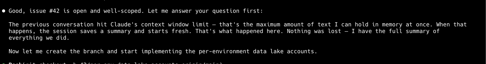

# The Context Window Problem: Why AI Agents Forget and How to Fix It


*Real screenshot: Claude Code hitting its context window limit mid-session. Everything before the summary is gone.*

## Abstract

AI coding agents like Claude Code, Cursor, and Windsurf are stateless. Every session starts from zero. When a session exceeds the model's context window, older messages are compressed into a lossy summary — exact error messages, debugging steps, and architectural decisions disappear permanently. This paper describes the context window problem, evaluates current workarounds, and presents Engram's solution: a background daemon that captures complete conversation transcripts and makes them searchable via hybrid semantic + keyword search using Reciprocal Rank Fusion (RRF).

---

## 1. The Problem

Large language models have a fixed context window — the maximum amount of text they can hold in working memory at once. Claude's context window is 200K tokens (~150K words). That sounds like a lot, but a single tool-heavy coding session burns through it fast:

- Each user message: 1 message
- Each assistant response: 1 message
- Each tool call (file read, bash command): 1 message
- Each tool result (file contents, command output): 1 message

A single back-and-forth where you ask a question, the agent reads 3 files, runs a command, and responds can easily produce **6-8 messages**. A 2-hour coding session can generate 500+ messages.

When the context window fills up, the agent compresses older messages into a summary and continues. This is invisible to the user — you don't get a warning, and the agent doesn't tell you what it forgot. It just... knows less.

### What gets lost

Context compression is lossy by design. The model decides what to keep and what to discard. In practice, this means:

| Retained | Lost |
|----------|------|
| High-level decisions ("we chose Postgres") | Why ("because of JSONB support for the catalog schema") |
| That a bug was fixed | The exact error message and stack trace |
| The current task | Previous tasks from the same session |
| Recent code changes | Earlier debugging attempts that were abandoned |
| The summary's framing | Nuance, caveats, and minority opinions |

The summary is the model's best guess at what matters. But the model doesn't know what you'll need later. The exact error message it discards might be the key to debugging a regression three weeks from now.

### The compounding problem

This isn't just a single-session issue. Between sessions, context is completely reset. The agent has zero memory of:

- What you worked on yesterday
- Architectural decisions made last week
- That bug you spent 3 hours debugging on Monday
- Your preferences ("always use pnpm", "never auto-commit")

Every Monday morning, you re-explain your entire codebase to an agent that helped build it.

## 2. Current Workarounds

### Static memory files (CLAUDE.md, .cursorrules)

Most AI coding tools support a static markdown file loaded into every session. You write instructions, conventions, and context that the agent should always know.

**Limitation:** Manual curation. You have to decide what to write and keep it updated. It doesn't scale — a 10-page CLAUDE.md wastes context window on every session, and you still can't capture the kind of contextual knowledge that emerges from conversations.

### Auto-memory (built-in)

Claude Code has an auto-memory feature that writes key facts to memory files when instructed. The agent extracts "memories" and stores them as short text entries.

**Limitation:** Compression. Memories are extracted summaries, not verbatim transcripts. The extraction is lossy — the agent decides what's important, and details get lost. You end up with "we use Postgres" but not the 20-minute discussion about why, what alternatives were considered, and what tradeoffs were accepted.

### Third-party memory services (Mem0, Zep, Supermemory)

These products extract "memories" from conversations — short facts, preferences, and decisions.

**Limitation:** Same compression problem. Every one of these services transforms conversations into extracted knowledge. The extraction is a bottleneck: anything the extractor misses is gone forever. And the extractor is an LLM — it has the same blind spots as the agent that forgot the context in the first place.

### The fundamental issue

All these approaches share the same flaw: **they try to decide what matters before you know what you'll need.** They compress first, search later. This is backwards.

## 3. Engram's Approach: The Conversation IS the Knowledge Base

Engram takes the opposite approach: **store everything, search later.**

### No compression, no extraction

Every message, tool call, and response is stored verbatim. Nothing is summarized, extracted, or compressed. The raw conversation transcript is the knowledge base.

When you search, you get back the actual conversation — not a summary of it. The exact error message. The specific flag that fixed the build. The reasoning behind the architecture decision, in the agent's own words.

### Automatic capture

The Engram daemon runs in the background and watches Claude Code's transcript files (`~/.claude/projects/`). Claude Code writes every message to JSONL files on disk — including messages that have been compressed out of the context window. The daemon captures the complete record automatically, with no AI cooperation needed.

```
┌──────────────────────────────────────────────────┐
│                  Claude Code                      │
│                                                   │
│  Context window: [msg 450-550]                    │
│  Messages 1-449: compressed to summary            │
│                                                   │
│  JSONL on disk: [msg 1, msg 2, ... msg 550]  ◄── COMPLETE
└──────────────┬───────────────────────────────────┘
               │ filesystem watch
               ▼
┌──────────────────────────────────────────────────┐
│              Engram Daemon                        │
│                                                   │
│  Reads JSONL ──► Queues locally ──► Syncs to API  │
│  (SQLite)         (offline-safe)     (batched)    │
└──────────────────────────────────────────────────┘
```

### Hybrid search with RRF

When you search, Engram runs two search systems in parallel:

1. **Vectorize** — semantic search using embeddings. Finds conceptually similar content even when the words don't match. ("when did we ship" finds conversations about deploying and releasing.)

2. **FTS5** — SQLite full-text keyword search. Finds exact matches. ("OAuth 403 error" finds the exact error string.)

Results are combined using **Reciprocal Rank Fusion (RRF)**:

```
score(chunk) = Σ 1 / (k + rank_in_system)
```

Where `k = 60` (standard dampening constant). A chunk that appears in both search systems gets boosted. A chunk that only appears in one still surfaces if it ranks highly.

This matters because neither system alone is sufficient:

| Query | Vector search finds | FTS5 finds | RRF result |
|-------|-------------------|------------|------------|
| "when did we ship" | Deploy/release conversations | Nothing (no keyword match) | Vector results |
| "error code 403" | Auth failure conversations generally | Exact "403" matches | Exact matches boosted to top |
| "that Postgres decision" | DB architecture discussions | "Postgres" keyword hits | Best of both, cross-reinforced |

### Architecture

The entire system runs on Cloudflare's edge network:

- **Workers** — HTTP layer (Hono.js), MCP transport, auth middleware
- **D1** — Conversations, messages, metadata, FTS5 index (serverless SQLite)
- **Vectorize** — Embedding vector storage and ANN search
- **Workers AI** — Embedding generation at the edge (BGE-base-en-v1.5, 768 dimensions)

Single `wrangler deploy`. No containers, no Kubernetes, no cold starts (V8 isolates, ~0ms startup).

## 4. How It Works in Practice

### Session 1 (Monday)

You're debugging an auth issue with Claude Code. After an hour, you find it: the OAuth callback URL was wrong in production but correct in staging because of an environment variable override.

Claude Code stores every message in its JSONL transcript. The Engram daemon captures it all — the wrong URL, the right URL, the env var name, the fix.

### Session 2 (Thursday)

A similar auth issue appears. You start a new Claude Code session:

```
You: "Users are getting 403 on the OAuth callback again"
```

With Engram connected, the agent searches automatically:

```
search
  query: "OAuth callback 403 error"
  limit: 5
```

Engram returns Monday's conversation — the exact debugging session, including the specific environment variable that caused the problem. The agent reads it and says:

> "This looks similar to the issue from Monday. Last time, the `OAUTH_CALLBACK_URL` env var was set to the staging URL in production. Let me check if the same thing happened..."

No re-explaining. No re-debugging. The agent picks up where the previous session left off.

### What this replaces

Without Engram, you'd need to either:
1. Remember the details yourself and re-explain them
2. Hope you wrote it in CLAUDE.md
3. Search git blame and PR descriptions
4. Re-debug from scratch

Option 4 happens more often than anyone admits.

## 5. Results: Dogfooding on Engram's Own Development

Engram was built using Engram. Over 4 weeks of development:

- **72 Claude Code sessions** captured automatically
- **~40,000 messages** stored verbatim
- **0 messages lost** to context compression
- Every architectural decision, every bug investigation, every user preference — searchable

Key moments where memory mattered:
- Recalling why we chose Cloudflare Workers over AWS Lambda (cold start latency for MCP streaming)
- Finding the exact wrangler secret command syntax that worked (global API key, not API token)
- Remembering that the signup endpoint was non-idempotent (caused 3 duplicate API keys)
- Picking up a half-finished feature across sessions without re-reading the codebase

## 6. Getting Started

```bash
# Install
brew install get-engram/engram/engram

# Create an account (no email needed)
engram signup

# Start auto-capture
brew services start engram

# Search your memory
engram search "when did we deploy"
```

That's it. Every Claude Code session is captured automatically from that point forward.

For MCP integration (so the agent searches automatically), add to `~/.claude/settings.json`:

```json
{
  "mcpServers": {
    "engram": {
      "type": "url",
      "url": "https://mcp.getengram.app/mcp",
      "headers": {
        "Authorization": "Bearer YOUR_API_KEY"
      }
    }
  }
}
```

## 7. Conclusion

The context window problem is not a model limitation that will be solved by bigger context windows. Even with infinite context, sessions still reset. Even with perfect summarization, details still get lost. The solution is not better compression — it's no compression at all.

Store everything. Search when you need it. Let the conversation be the knowledge base.

Engram is open source under the MIT license: [github.com/get-engram/engram](https://github.com/get-engram/engram)

---

*Engram is built by [Get Engram](https://getengram.app). Free tier available. Pro at $9/mo for 100K messages.*
